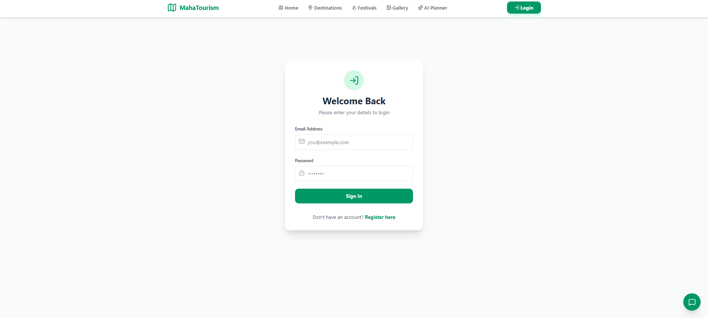
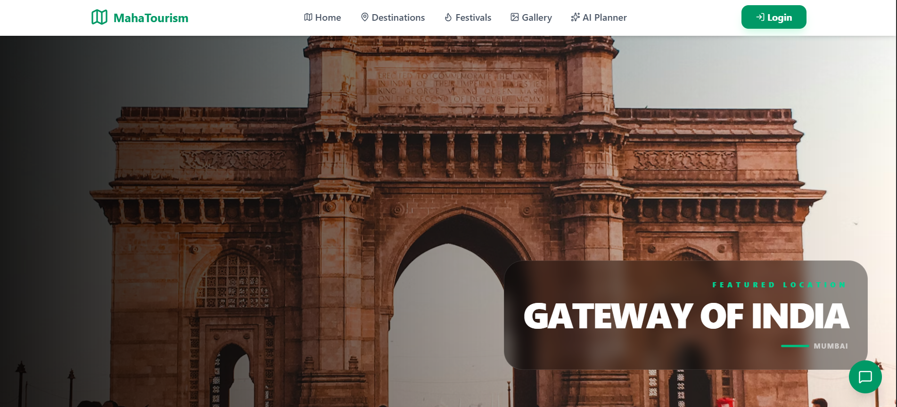
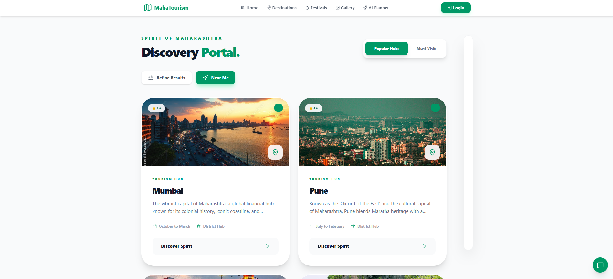
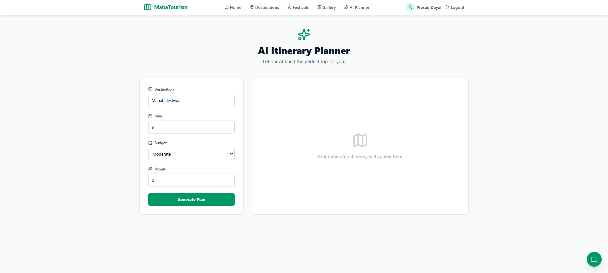

<div align="center">

# 🌍 AI-Powered Smart Tourism System

### 🚀 Discover • Plan • Explore Maharashtra with Artificial Intelligence

<p align="center">
  
  
  
  
  
  
</p>

**An intelligent tourism platform that helps travelers discover destinations, generate personalized itineraries, receive AI recommendations, and explore Maharashtra efficiently.**

</div>

---

# 📖 Overview

The **AI-Powered Smart Tourism System** is a full-stack web application designed to modernize tourism by integrating Artificial Intelligence with traditional travel planning.

The platform provides users with personalized recommendations, destination information, AI-powered suggestions, secure authentication, and an intuitive interface for planning memorable trips.

---

# ✨ Features

## 👤 User Features

- 🔐 Secure Login & Registration
- 👨 User Profile Management
- 🏞 Explore Tourist Destinations
- 📍 Destination Details
- ❤️ Wishlist / Favorites
- 🗺 Smart Trip Planning
- 🤖 AI-Based Travel Recommendations
- 📅 Personalized Itinerary Generation
- 🌤 Weather Information
- ⭐ Ratings & Reviews
- 📸 Beautiful Destination Gallery

---

## 🤖 AI Features

- AI Travel Recommendation Engine
- Smart Destination Suggestions
- Crowd Prediction Model
- Personalized Itinerary
- Intelligent Travel Assistance
- AI-based Decision Making
---

# 🛠 Tech Stack

## Frontend

- React.js
- Vite
- HTML5
- CSS3
- JavaScript
- Axios
- React Router

---

## Backend

- Spring Boot 3
- Java 17
- Spring Security
- Spring Data JPA
- REST APIs
- JWT Authentication
- Maven

---

## Database

- MySQL

---

## AI / Machine Learning

- ONNX Runtime
- AI Recommendation Model
- Crowd Prediction Model

---

# 📂 Project Structure

```
Tourism/
│
├── frontend/
│   ├── src/
│   ├── public/
│   ├── ai_models/
│   └── package.json
│
├── src/
│   ├── main/
│   │   ├── java/
│   │   ├── resources/
│   │   └── templates/
│   │
│   └── test/
│
├── pom.xml
│
└── README.md
```

---

# ⚙ Installation

## Clone Repository

```bash
git clone https://github.com/yourusername/AI-Tourism-System.git
```

```bash
cd AI-Tourism-System
```

---

## Backend Setup

Configure MySQL database.

Update:

```
application.properties
```

Example

```properties
spring.datasource.url=jdbc:mysql://localhost:3306/tourism
spring.datasource.username=root
spring.datasource.password=yourpassword
```

Run

```bash
mvn clean install
```

```bash
mvn spring-boot:run
```

Backend runs on

```
http://localhost:8080
```

---

## Frontend Setup

```bash
cd frontend
```

Install dependencies

```bash
npm install
```

Run

```bash
npm run dev
```

Frontend

```
http://localhost:5173
```

---

# 📸 Screenshots

Add your project screenshots here.
### Login Page


### Home Page


### Cities


### AI Planner

---

# 🚀 Future Enhancements

- Voice Assistant
- Hotel Booking
- Flight Booking
- AI Chatbot
- Google Maps Integration
- Live Traffic
- Real-time Crowd Prediction
- AR Tourist Guide
- Multi-language Support
- Online Payment
- Emergency Assistance

---

# 🎯 Learning Outcomes

- Full Stack Development
- Spring Boot
- React
- REST API Development
- JWT Authentication
- AI Integration
- Database Design
- Secure Web Applications

---

# 📄 License

This project is developed for educational and learning purposes.

---

# 👨‍💻 Developer

**Prasad Dayal**

---

<div align="center">

### ⭐ If you like this project, don't forget to Star the Repository ⭐

**Happy Coding ❤️**

</div>
